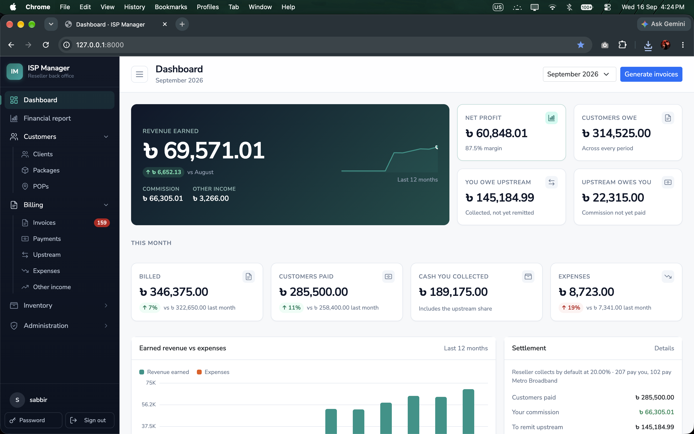
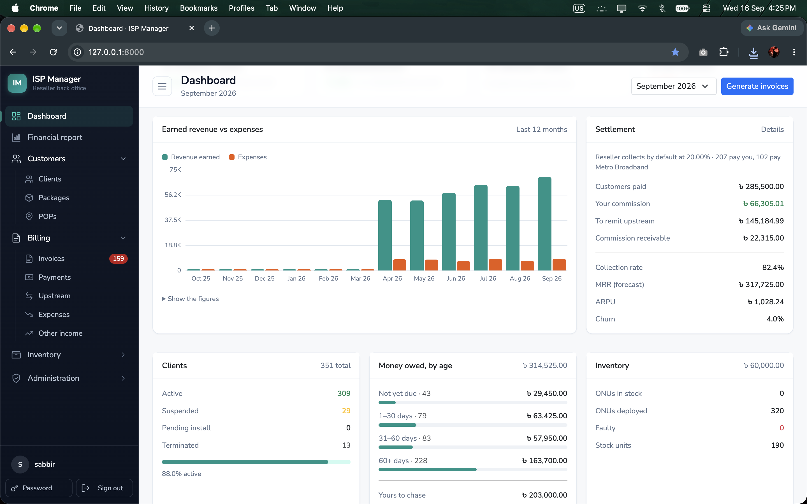
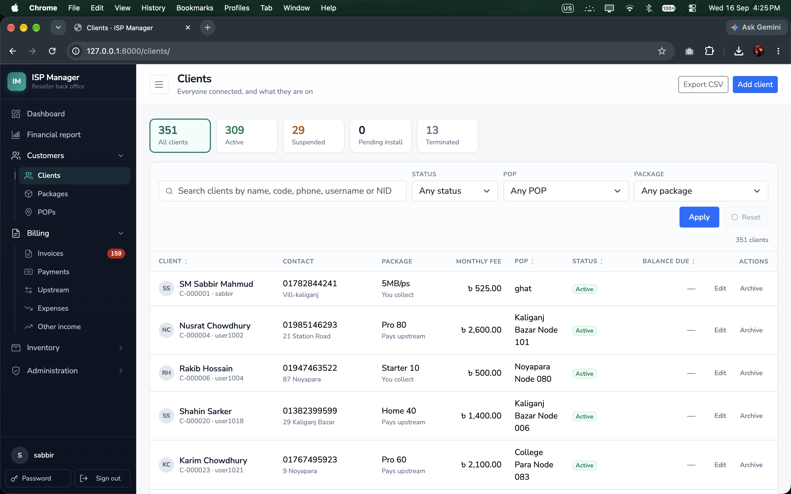
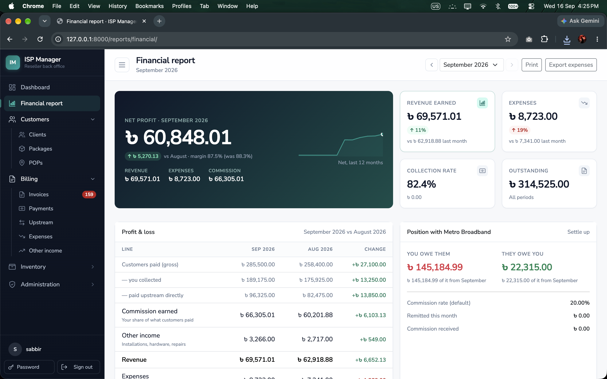
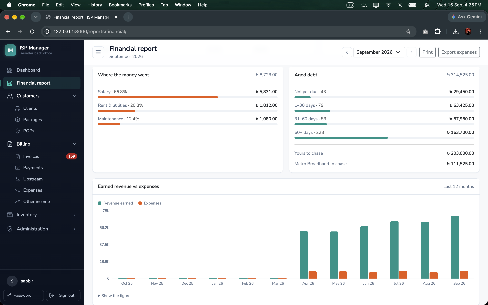

<div align="center">

# ISP Manager

**The back office for an internet service reseller.**
Clients, packages, monthly billing, payments, the upstream split, stock and
the reports that say whether the business is making money — in one place.

[](https://www.python.org/)
[](https://www.djangoproject.com/)
[](https://www.postgresql.org/)
[](#development)
[](LICENSE)

[Features](#features) ·
[Screenshots](#screenshots) ·
[Quick start](#quick-start) ·
[Deployment](#deploying-to-a-server) ·
[Documentation](#documentation) ·
[Author](#author)



</div>

---

## Contents

- [Why it exists](#why-it-exists)
- [Features](#features)
- [Screenshots](#screenshots)
- [The two reseller arrangements](#the-two-reseller-arrangements)
- [Quick start](#quick-start)
- [Deploying to a server](#deploying-to-a-server)
- [Configuration](#configuration)
- [Roles and access](#roles-and-access)
- [Development](#development)
- [Tech stack](#tech-stack)
- [Documentation](#documentation)
- [Contributing](#contributing)
- [License](#license)
- [Author](#author)

## Why it exists

A reseller buys bandwidth from an upstream operator and sells connections to
homes and shops. The hard part is not the network — it is the money: who paid,
who owes, what share belongs upstream, and what is actually profit once that
share is gone. Most resellers keep that in spreadsheets.

ISP Manager keeps it in one application, with the rules written down in code
and covered by tests.

> **Scope:** it records and reports on the business. It does not talk to
> MikroTik, Cisco or any network hardware, and never provisions or disconnects
> a connection.

## Features

<table>
<tr>
<td width="50%" valign="top">

### 👥 Customers
- Clients with status, POP, ONU, contact and NID
- One search box across name, code, phone, username and NID
- Plans priced per client, frozen at sign-up
- Packages with speed, cached traffic and commission
- POPs in a parent–child tree

</td>
<td width="50%" valign="top">

### 🧾 Billing
- Monthly invoices with a dry-run preview, safe to re-run
- Partial payments, with live previews of what a payment leaves owing
- Overdue tracking and aged debt
- Both settlement arrangements, and the balance each way
- Expense and other-income ledgers with trends

</td>
</tr>
<tr>
<td width="50%" valign="top">

### 📦 Inventory
- Serialised ONUs, tracked from shelf to client
- Stock items whose quantity is the sum of a movement ledger
- Reorder levels, low-stock alerts, stock value
- Categories with what each holds and is worth

</td>
<td width="50%" valign="top">

### 📊 Reporting
- Dashboard: revenue earned, net profit, collection rate, MRR, ARPU, churn
- Monthly profit & loss against the previous month
- Where the money went, and who still owes it
- CSV exports

</td>
</tr>
<tr>
<td colspan="2" valign="top">

### 🔐 Access and safety
Four roles backed by real Django permissions · throttled sign-in with lockout ·
safeguards against removing the last owner · every record stamped with who made
and changed it · HSTS, secure cookies and TLS redirects when `DEBUG=False`

</td>
</tr>
</table>

## Screenshots

<table>
<tr>
<td width="50%">
<a href="images/dashboard-trends.png"></a>
<p align="center"><sub><b>Dashboard</b> — twelve-month trend, settlement and aged debt</sub></p>
</td>
<td width="50%">
<a href="images/clients.png"></a>
<p align="center"><sub><b>Clients</b> — status chips, one-box search, sortable table</sub></p>
</td>
</tr>
<tr>
<td width="50%">
<a href="images/financial-report.png"></a>
<p align="center"><sub><b>Financial report</b> — net profit and the P&amp;L, month on month</sub></p>
</td>
<td width="50%">
<a href="images/financial-report-breakdown.png"></a>
<p align="center"><sub><b>Financial report</b> — where the money went, and who owes it</sub></p>
</td>
</tr>
</table>

## The two reseller arrangements

Resellers settle with their upstream operator in one of two ways. ISP Manager
supports both — including a mix of the two in one customer base.

| | **You collect** | **Client pays upstream** |
| --- | --- | --- |
| Who the customer pays | you | the upstream operator, online |
| What you hold | the full bill | nothing |
| What you earn | your commission, kept from what you collected | your commission, paid to you later |
| Running balance | **you owe upstream** the rest | **upstream owes you** the commission |

Set the default under **Billing → Settings** and override it per client. The
commission rate resolves the same way:

```
the client's own rate  →  the package's rate  →  the rate in billing settings
```

Both are copied onto each invoice when it is raised, so changing them later
never rewrites what past months were worth. **Billing → Upstream** shows both
running balances, month by month, and the settlements that paid them down.

> **Money you remit upstream is not an expense.** It was never your revenue —
> your revenue is the commission — so it is recorded as a settlement, never in
> the expense ledger. Every profit figure in the app follows this rule.

## Quick start

Requires **Python 3.14**.

```bash
git clone https://github.com/sabbir-mahmud/isp-management-for-reseller.git
cd isp-management-for-reseller

make install                  # virtualenv + dependencies
cp .env.example .env          # then set SECRET_KEY, and DEBUG=True for local work

make migrate                  # database + staff roles
make seed                     # optional demo data
make run
```

Open <http://127.0.0.1:8000/>.

The demo data adds 350 clients, 15 packages, 150 POPs and six months of
billing, with four logins — `owner`, `manager`, `accountant`, `support` — all
using the password `demopass123`. Sign in as each to see what a role can reach.
Prefer an empty start? Run `make superuser` instead of `make seed`.

Or, with Docker:

```bash
cp .env.example .env          # set SECRET_KEY
docker compose up --build     # Postgres + Redis + gunicorn on :8000
```

**→ Full guide, including Windows notes and troubleshooting:
[docs/INSTALLATION.md](docs/INSTALLATION.md)**

## Deploying to a server

The production setup is gunicorn behind nginx with HTTPS, PostgreSQL for data
and Redis for the shared cache.

```
browser ──HTTPS──▶ nginx ──▶ gunicorn ──▶ PostgreSQL
                                     └──▶ Redis
```

In short:

1. Install Python 3.14, PostgreSQL, Redis and nginx.
2. Clone into `/srv/isp-manager`, create a virtualenv, install `requirements.txt`.
3. Fill in `.env`: `SECRET_KEY`, `DEBUG=False`, `ALLOWED_HOSTS`,
   `CSRF_TRUSTED_ORIGINS`, `DATABASE_URL`, `REDIS_URL`.
4. `migrate`, `collectstatic`, `createsuperuser`, then `check --deploy`.
5. Run gunicorn under systemd on `127.0.0.1:8000`.
6. Proxy to it from nginx and add a certificate with certbot.
7. Schedule the two jobs below, and nightly database backups.

```cron
0 1 1 * * cd /srv/isp-manager/app && ../venv/bin/python manage.py generate_invoices
0 2 * * * cd /srv/isp-manager/app && ../venv/bin/python manage.py refresh_overdue
```

**→ Step-by-step, with the systemd unit, nginx site, firewall, backups,
updates and a Docker Compose alternative:
[docs/DEPLOYMENT.md](docs/DEPLOYMENT.md)**

## Configuration

Everything is read from the environment (or `.env`). Nothing in
`isp_management/settings.py` needs editing between environments.

| Variable | Notes |
| --- | --- |
| `SECRET_KEY` | **Required.** The app will not start without it |
| `DEBUG` | `False` by default; turns on HSTS, secure cookies and TLS redirects |
| `ALLOWED_HOSTS` | Comma-separated; required in production |
| `CSRF_TRUSTED_ORIGINS` | Full origins, e.g. `https://isp.example.com` |
| `DATABASE_URL` | Omit for local SQLite; `postgres://…` in production |
| `REDIS_URL` | Shared cache; needed with more than one worker |
| `SITE_NAME` / `CURRENCY_SYMBOL` / `TIME_ZONE` | Branding, currency and local time |
| `ADMIN_URL` | Moves the Django admin off `admin/` |
| `LOGIN_FAILURE_LIMIT` / `LOGIN_FAILURE_TIMEOUT` | Sign-in throttle |
| `TRUST_PROXY_HEADERS` | `True` only behind a proxy that sets `X-Forwarded-For` |

The full list, with notes, is in [`.env.example`](.env.example).

## Roles and access

| Role | Can |
| --- | --- |
| **Owner** | Everything, including staff accounts, billing settings and deleting records |
| **Manager** | Clients, packages, stock and billing; cannot remove money records or manage staff |
| **Accountant** | Invoices, payments, ledgers, upstream and reports; reads clients and stock |
| **Support** | Looks clients up, edits their details and ONUs, issues stock; reads invoices only |

Roles live in [`apps/users/roles.py`](apps/users/roles.py) and are applied as
Django groups by `sync_roles`, which runs after every `migrate`. That matrix is
the only supported way to change access — permissions granted by hand in the
admin are removed on the next sync.

## Development

```bash
make test        # 390 tests
make coverage    # with a coverage report
make lint        # ruff check + format check
make format      # apply fixes
make check       # system checks, migration drift, deployment audit
make help        # every target
```

Tests live in `tests/` and run against a real database through pytest-django.
They cover the billing rules, both settlement arrangements and the commission
arithmetic, metric definitions, role permissions, the sign-in throttle, model
constraints, and every page.

<details>
<summary><b>Project layout</b></summary>

```
apps/
  accounts/      clients, packages, subscriptions
  accountants/   invoices, payments, upstream settlements, ledgers, billing settings
  warehouse/     POPs, stock, movements, ONUs
  reports/       dashboard, financial report, exports
  users/         sign-in, staff, roles
  core/          shared mixins, template tags, helpers
templates/       pages and partials
static/          css, js, fonts, vendored Bootstrap and htmx
docs/            installation, deployment, architecture, operations
tests/           the test suite
```

</details>

## Tech stack

| Layer | Choice |
| --- | --- |
| Language | Python 3.14 |
| Framework | Django 6.1, django-filter |
| Database | PostgreSQL 15+ (SQLite for local work) |
| Cache | Redis |
| Front end | Server-rendered templates, Bootstrap 5, htmx, a little vanilla JS |
| Serving | gunicorn, WhiteNoise, nginx |
| Tooling | pytest, ruff, Docker |

## Documentation

| Guide | What is in it |
| --- | --- |
| [Installation](docs/INSTALLATION.md) | Local setup, demo data, Docker, troubleshooting |
| [Deployment](docs/DEPLOYMENT.md) | Ubuntu server with systemd, nginx and HTTPS; Docker Compose; jobs, backups, updates |
| [Operations](docs/OPERATIONS.md) | The month-end routine, common tasks, and what to do when something looks wrong |
| [Architecture](docs/ARCHITECTURE.md) | How the layers fit, the money model, the deletion policy, and what was left out on purpose |

## Contributing

Issues and pull requests are welcome.

1. Fork the repository and create a branch from `main`.
2. Make your change, with tests for any behaviour it adds or fixes.
3. Run `make lint` and `make test` — both must pass.
4. Open a pull request describing what changed and why.

For anything large, please open an issue first so the approach can be agreed
before the work is done.

## License

Released under the [MIT License](LICENSE) — free to use, modify and
distribute, including commercially, as long as the copyright notice is kept.

## Author

<table>
<tr>
<td>

**Sabbir Mahmud**

- GitHub: [@sabbir-mahmud](https://github.com/sabbir-mahmud)
- Email: [sabbir.mahmud.zim@gmail.com](mailto:sabbir.mahmud.zim@gmail.com)

If ISP Manager is useful to you, a ⭐ on the
[repository](https://github.com/sabbir-mahmud/isp-management-for-reseller)
helps others find it.

</td>
</tr>
</table>
